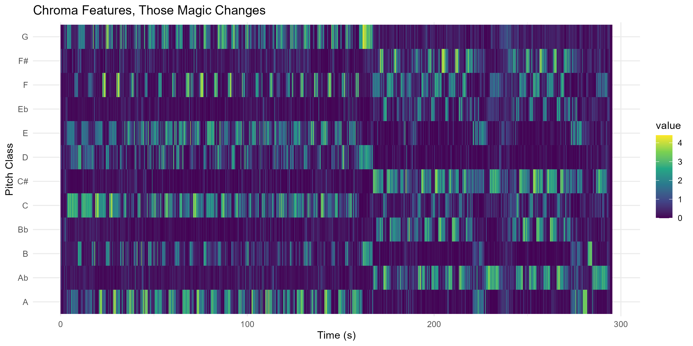

## Week 7 – Corpus Description & Spotify Feature Visualisation
---
Corpus Description

The corpus consists of approximately 100 tracks selected from my personal EDM playlist on Spotify. The playlist focuses on mainstream electronic dance music, including artists such as Calvin Harris, Avicii, Swedish House Mafia, Martin Garrix, and similar producers. Although the tracks vary in production style and popularity, they share common structural characteristics such as repetitive chord progressions, build-ups, and high-energy drop sections. By selecting a larger dataset, the analysis becomes more reliable and allows for clearer identification of structural patterns across the genre.

The central research question is:

Does my preference for mainstream EDM share consistent structural patterns when examined through computational audio features and chroma-based analysis?

Using Spotify’s track-level features (energy, tempo, danceability, loudness, etc.), this corpus enables comparison between perceived musical structure and measurable audio properties. With a dataset of around 100 tracks, it becomes possible to explore whether EDM tracks cluster together in feature space and whether characteristics such as high energy and tempo values are consistently present. In addition, chromagram visualisations are used to examine harmonic repetition and dynamic intensity over time. By combining feature-based analysis with listening observations, this project investigates whether the structural traits typical of EDM can be detected computationally.

## Week 8 – Chroma Feature Visualisation (Sonic Visualiser)
---
For this assignment, I created a chromagram of Calvin Harris, Summer, and visualised the
chroma features in R. I normalised the chroma vectors using the Euclidean norm so that each
time frame is scaled in a comparable way. This helps focus on the relative distribution of
pitch-class energy instead of differences in overall loudness.

In the chromagram, you can clearly see strong horizontal bands, especially around G, D, E, and
B. These bands show which pitch classes are consistently active throughout the track. Because
the song is based on repetitive chord progressions, typical for EDM, the chromagram shows
recurring vertical patterns over time. These repeating structures match the looping harmonic
cycles that can be heard when listening.

The brighter colours appear mostly during the drop sections, where the sound becomes fuller
and more energetic. In contrast, the breakdown sections show less overall intensity, which
reflects the thinner texture and reduced instrumentation. Overall, the visualisation makes the
harmonic structure and repetition of the track clearly visible and corresponds closely to what is
heard in the music.

## Self-Similarity Analysis (Week 9)

This analysis compares timbre-based and chroma-based self-similarity matrices for:

Avicii – Levels

Swedish House Mafia – Don’t You Worry Child

The goal is to examine how production (timbre) and harmony (chroma) reveal structural patterns in EDM tracks.

Avicii – Levels  
Timbre-Based Self-Similarity (MFCC)

The timbre-based matrix shows strong vertical lines marking section boundaries, especially around the breakdown and drop transitions. Large square regions indicate consistent production texture within sections. The drop section forms a clear high-similarity block, reflecting stable instrumentation and energy.

This representation highlights structural changes driven by production intensity.

Chroma-Based Self-Similarity

The chroma-based matrix emphasizes harmonic repetition. Repeating diagonal blocks indicate recurring chord progressions across sections. Compared to timbre, the internal harmonic similarity within sections is more visible, while boundaries are slightly softer.

This representation captures harmonic structure rather than production shifts.

Swedish House Mafia – Don’t You Worry Child

The timbre matrix clearly reveals major transitions between intro, build-up, and drop sections. Strong vertical bands indicate structural boundaries. The drop section again appears as a large consistent block, reflecting stable production texture.

This confirms that texture and production intensity strongly define the song structure.

Chroma-Based Self-Similarity

The chroma matrix shows repeating harmonic blocks and diagonal similarity patterns. The drop sections exhibit strong harmonic consistency, while repeated chord progressions are visible across different parts of the song.

Compared to timbre, this representation focuses more on harmonic repetition than production changes.

Overall, both representations reveal a strong sectional structure typical of EDM tracks. In both Levels and Don’t You Worry Child, large square blocks correspond to drop sections, while clear vertical bands indicate transitions between intro, build-up, breakdown, and drop. This shows that the songs are organized around repeated high-energy sections separated by distinct structural changes.

The timbre-based SSM (MFCC) emphasizes production and texture shifts, making section boundaries more pronounced. In contrast, the chroma-based SSM highlights harmonic repetition, showing recurring chord progressions and internal similarities within sections. Although both matrices display similar global structure, they focus on different musical aspects: timbre captures changes in instrumentation and intensity, while chroma captures harmonic consistency.

Together, these representations provide complementary perspectives on the structural organization of EDM music.

# Week 10 – Key and Chord Analysis

For Week 10, I analysed chroma features for the class corpus track *Those Magic Changes* from the musical Grease.

The figure below shows the distribution of pitch-class energy over time.

